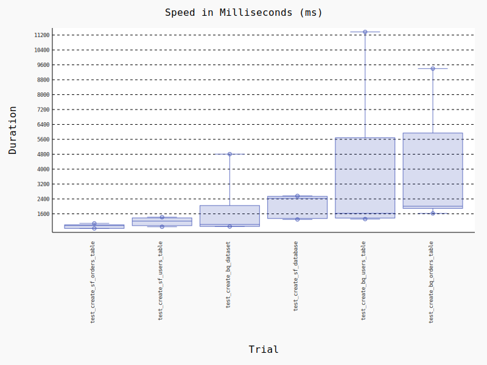
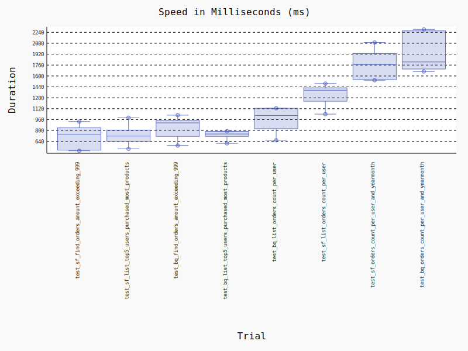

# Table of Contents

- [Analysis](#analysis)
- [Setup](#setup)
- [Tests](#tests)

## Analysis

| - | Snowflake | BigQuery | Similarities |
|:---------:|---------|---------|---------|
| **Overview**| Snowflake is a cloud data platform with separated compute and storage, operates on AWS, Azure, and Google Cloud.| BigQuery is a serverless data warehouse solution, and it's primarily a Google Cloud service. | Both are cloud-native data platforms designed for large-scale data warehousing and analytics. Both support SQL-based querying. |
| **Infrastructure & Scalability** | Snowflake uses elastic virtual warehouses for scaling compute, emphasizes the separation of storage and compute. | BigQuery scales automatically in a serverless manner, and BigQuery has integrated storage and compute. | Both can handle petabytes of data. Both offer automatic scalability based on demand. |
| **Data Handling & Management** | Snowflake provides native functionalities to share data without duplication. Can integrate with platforms like dbt for transformations. | BigQuery relies on Google Cloud's ecosystem for data sharing, and BigQuery has native handling of nested and repeated data.| Both support structured and semi-structured data. Both offer data streaming capabilities.|
| **Security & Compliance** | Snowflake has its security infrastructure which can be integrated across different cloud providers.| BigQuery seamlessly integrates with Google Cloud's security model.| Both prioritize security with features like encryption at rest and in transit, and role-based access control. Both platforms are compliant with major regulatory standards.|
| **Development & Ecosystem** | Snowflake, being multi-cloud, integrates with services across various cloud providers. | BigQuery is deeply integrated with the Google Cloud ecosystem, benefiting from Google services. |Both platforms are compatible with popular BI tools. Both have a rich set of APIs and SDKs for development and integration.|

```
In summary, while Snowflake and BigQuery share several similarities in terms of their overarching goals and some functionalities, their approaches, architectures, and integrations reflect their unique design philosophies and the ecosystems they cater to. The choice between them often depends on specific organizational needs and existing tech infrastructure.
```

## Setup
1. Install Miniconda
macOS and Linux:
Run the following commands in your terminal:
```bash
# macOS
curl -LO https://repo.anaconda.com/miniconda/Miniconda3-latest-MacOSX-x86_64.sh

# Linux
curl -LO https://repo.anaconda.com/miniconda/Miniconda3-latest-Linux-x86_64.sh

# Install
bash Miniconda3-latest-*-x86_64.sh
```
Follow the prompts in the installer. Remember to restart your terminal or run source ~/.bashrc (or equivalent for your shell) after installation.

2. Create a Conda Environment and activate it
```bash
conda create --name sf_vs_bq python=3.10
conda activate sf_vs_bq
```

3. Install Required Libraries
Navigate to the project directory and run:
```bash
pip install -r requirements.txt
```

## Tests

### Test tables

```Users```
- schema

| Column Name | Date type | Constrains |
|:---------:|---------|---------|
| user_id | STRING | PK |
| username | STRING |  |
| email | STRING |  |

- Number of rows: 10,000
- Source Data:
    - [Pickle](https://github.com/allan-cl/snowflake_vs_bigquery/blob/main/data/faker_users.pkl)
    - [CSV](https://github.com/allan-cl/snowflake_vs_bigquery/blob/main/data/faker_users.csv)


``` Orders ```
- schema

| Column Name | Date type | Constrains |
|:---------:|---------|---------|
| order_id | STRING | PK |
| user_id | STRING | FK |
| product | STRING |  |
| amount | STRING |  |
| order_time | TIMESTAMP |  |


- Number of rows: 504,106
- Source Data:
    - [Pickle](https://github.com/allan-cl/snowflake_vs_bigquery/blob/main/data/faker_users.pkl)
    - [CSV](https://github.com/allan-cl/snowflake_vs_bigquery/blob/main/data/faker_users.csv)

Fake Data Generator: https://github.com/allan-cl/snowflake_vs_bigquery/blob/main/data/datafaker.py


### Run tests
To run the tests for this project:
```bash
# Run SETUP tests
#
# Test Cases on BOTH Datahouses
# 1. create dataset
# 2. create users table
# 3. create orders table
pytest tests/test_atc_setup.py --html=reports/test_atc_setup.html --benchmark-histogram=reports/test_atc_setup

# Run INSERT tests
#
# Test Cases on BOTH Datahouses
# 1. insert users table
# 2. insert orders table
pytest tests/test_atc_insert.py --html=reports/test_atc_insert.html

# Run QUERY tests
#
# Test Cases on BOTH Datahouses
# 1. List the number of orders for each user by month and year
# 2. Count of orders per user
# 3. Find orders that amount execeeding 999
# 4. Find top 5 users purchased most products
pytest tests/test_atc_query.py --html=reports/test_atc_query.html --benchmark-histogram=reports/test_atc_query
```

### Reports

#### Setup Tests

Click [HTML Report](https://htmlpreview.github.io/?https://github.com/allan-cl/snowflake_vs_bigquery/blob/main/reports/test_atc_query.html)



#### Insert Tests
Click [HTML Report](https://htmlpreview.github.io/?https://github.com/allan-cl/snowflake_vs_bigquery/blob/main/reports/test_atc_setup.html)

#### Query Tests
Click [HTML Report](https://htmlpreview.github.io/?https://github.com/allan-cl/snowflake_vs_bigquery/blob/main/reports/test_atc_query.html)




### Conclusion